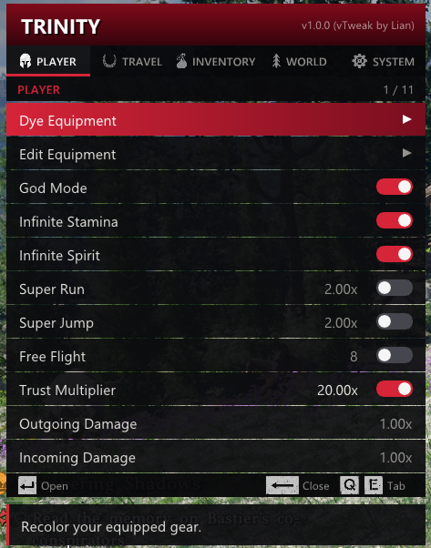
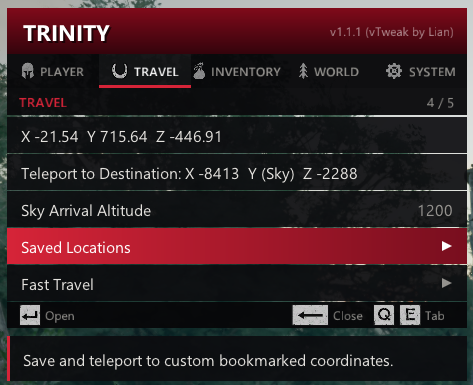
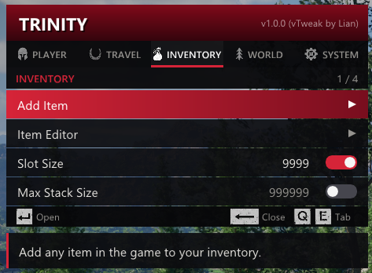
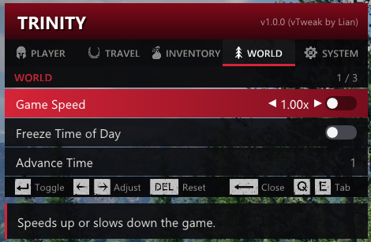
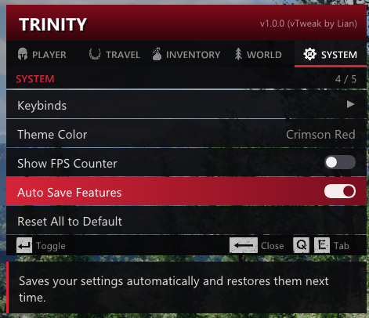
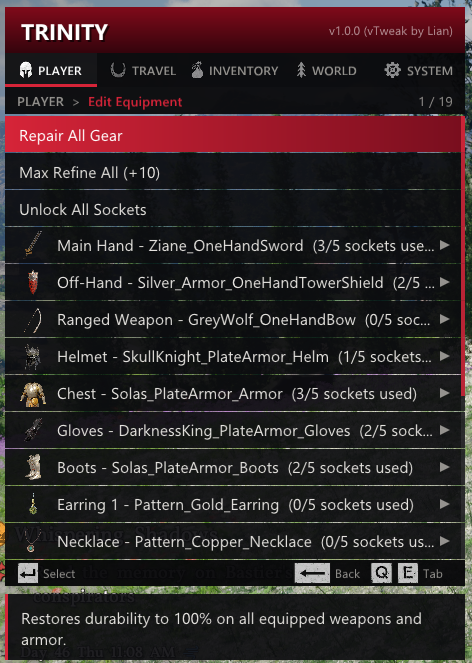
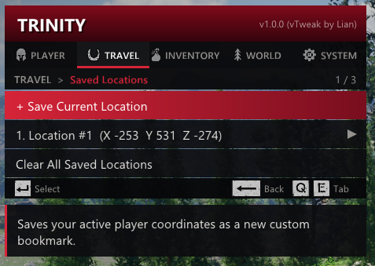
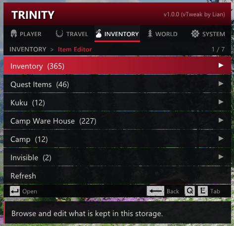

# Trinity — Crimson Desert (vTweak by Lian)

Trinity is an in-game DirectX 12 mod menu for **Crimson Desert**, originally created by **XeTrinityz**, with vTweak maintenance by **Lian**. The current **v1.4.1** work targets **TU 2.02.00 (PE 1.0.0.2850)**. Older layout/signature branches remain in the source; they are not a guarantee that every feature works on every earlier title update.

> **Single-player use only.** Do not use this project in online or anti-cheat-protected modes. This community project is not affiliated with or endorsed by Pearl Abyss.

---

## Screenshots & In-Game Previews

| Player Menu | Travel & Destination Teleport |
| :---: | :---: |
|  |  |

| Inventory & Max Stack Size | World & Game Speed Control |
| :---: | :---: |
|  |  |

| System Settings & Themes | Equipment Enhancer & Sockets |
| :---: | :---: |
|  |  |

| Unlimited Custom Bookmarks | Storage Filters & Item Editor |
| :---: | :---: |
|  |  |

---

## What's new in v1.4.1 — September 16, 2026

- **Material and condition controls now apply**: changing either control queues a dye retouch after a **350 ms debounce**. Single-zone and **All zones** edits preserve each dyed zone's own color; changing material leaves its condition intact, and vice versa. Material **0** uses the natural-material sentinel (`0xFFFF`) instead of template 1.
- **Named Dye Profiles**: save, preview, apply, rename, overwrite, and delete appearances, including all 12 zones, material, condition, and natural zones. Profiles are compatible with the same equipment type, game revision, and player/mount mode.
- **Equipment edit scheduling**: refinement and Abyss Gear edits use identity-stamped requests. Holder scans resume in bounded slices, unchanged readbacks no longer force repeated UI rebuilds, and equipment-profile disk writes run on a value-only worker.
- **Reload-aware stats**: player/mount stat discovery follows the current native array and count, including distinct client copies, rather than assuming a fixed 64-entry array.
- **Mount dye visuals**: resolve the mount's own client equipment and apply one channel per visit. Status distinguishes a requested visual refresh from a data-only result.
- **Optional performance diagnostics**: **SYSTEM → Performance Diagnostics**, default **OFF** (`perfLogging=0`).
- **Overlay synchronization**: four submission slots fence allocator/upload reuse independently of the swapchain's back-buffer index.

Latest verified local material-fix build: **`Sep 16 2026 20:47:43`**, SHA-256 `B9CEFD550960B41C7D2C5E6BB2A76D2F2A347C384FAE5BB9E70A96E718D824D8`. All **8 CTest suites**, including **21 source guards**, passed for that build. These are local checks; the material appearance and frame-time changes still need in-game retesting on the new artifact. See the [material fix report](2026-09-16_fix-dye-material-report.md).

## Earlier release notes

The following entries describe earlier releases. Current behavior and limitations are documented above and in the usage sections below.

### v1.3.2

- **New Combat Feature: Easy Parry (Just Guard)**:
   - Added guard-timing assistance; the current build uses the native just-window evaluator and damage-assist branches.
- **New Combat Feature: Easy Evade (Just Evade)**:
   - Added evade-timing assistance while the matching input is active/recent.
- **New Feature: No Bounty (Crime & Bounty Neutralizer)**:
   - Added wanted-state and bounty-price overrides. Current No Bounty uses the wanted-state evaluator and `WantedInfo` handling; the misidentified register-crime-event hook is disabled.
  - Preserves full vanilla combat behavior and mortality so NPCs and enemies can still be fought and defeated normally.

- **Universal Table Resolver for TU 2.00.01 (PE rev >= 2625)**:
  - Modernized scanner to detect `sub rsp, 50h` table prologue structures and opcode-relative table globals (`WantedInfo`, `tribeinfo`, `iteminfo`, etc.).
  - Added continuous per-frame upkeep so mod overrides seamlessly persist across fast travel and zone transitions.

---

### v1.3.1

- **Critical CTD Fixes & Engine Hardening**:
  - **Fixed NPC Greeting / Interaction Crash (`Trinity.asi+0x19160`)**: Completely replaced inline code patches with SEH-guarded MinHook trampolines and robust pointer validation for quest and transient NPC records.
  - **Weapon Swapping Race Investigation (`CrimsonDesert.exe+0x121F192`)**: Separated gameplay mutation from rendering work. Current refinement/socket writes are queued, while UI reads use owned snapshots and fresh target validation at enqueue/apply.
  - **Character Switching Stability**: Improved character routing and guarded access; current reload handling additionally verifies native ownership and current-world membership.
- **Smart Equipped Gear Protection**:
  - Equipping weapons, armor, or accessories no longer falsely registers them as "Sold / Discarded" in the *Restore Lost & Sold Items* menu.
  - Automatically filters actively equipped gear on Kliff, Damiane, and Oongka from the buyback list.
- **Live Self-Healing Item Icons & Side-Panel Tooltips**:
  - Automatically queries the engine's live item definition tables (`IconForTypeId`) to heal corrupted or truncated icon strings from disk history, restoring full high-resolution artwork for all equipment and quest items.
  - Side-panel tooltip preview cards now render reliably for every selected item.
- **Proportional Trust Multiplier Scaling**:
  - Added gain scaling for gifting/feeding. The current UI offers 1.0x–25.0x and the setter implementation clamps the resulting trust value to 0–100.
- **Native Engine Game Speed Scaling (`hkFrameTimerUpdate`)**:
  - Replaced legacy fixed-timestep overrides with native engine frame timer scaling.

---

### v1.3.0

- **Crimson Desert TU 2.00.00 – 2.00.01 Full Support**:
  - Updated memory offsets, structures, and function signatures matching the major Title Update 2.00 overhaul.
  - Re-anchored item reflection tables (`iteminfo`, `ItemGroupInfo`, `stringinfo`, `Inventory`, and `TrItemValue` constructor) for seamless Add Item spawning.
- **Expanded Multi-Language Support**:
  - Added full native translations for: **English**, **German (Deutsch)**, **Spanish (Español)**, **French (Français)**, **Indonesian (Bahasa Indonesia)**, **Japanese (日本語)**, **Korean (한국어)**, **Portuguese - Brazil (Português - Brasil)**, **Russian (Русский)**, and **Simplified Chinese (简体中文)**.
- **Enhanced Character Resolution**:
  - Introduced multi-anchor character-manager verification; the current source uses nine anchors plus runtime ownership checks.

---

### v1.2.4

- **Smart Lost & Sold Items Tracker (Buyback & Recycle Bin)**:
   - Added differential quantity tracking with equipped-item checks; detected losses are labeled Sold / Discarded, without capturing the exact native transaction cause.
  - One-click restoration per item or bulk `>> Restore All Lost & Sold Items <<`.
  - Persistent disk storage (`Trinity_LostItems.txt`) so your buyback history persists across game sessions.
- **Quest & Special Item Catalog Archive**:
  - Dedicated searchable archive for 50+ Bounty Notices, Lore Documents, Recipes, Quest Keys, Relics, and Unique Gear.
- **Legacy Layout Support**: Added version-dependent inventory slot strides. Current TU 2.02 equipment tables use a separate, validated `0xD0` layout.
- **Runtime Binary Fingerprinting**: Live in-memory machine code scanner to accurately identify and display active Title Updates (e.g. `TU 1.18.02 (Active)`).
- **Cross-Slot Controller Free Flight**: Polling across controller slots 0 through 3 for robust multi-controller and PS5 pad support.
- **Dedicated Submenus**: Integrated **Money & Currency**, **Abyss Items & Artifacts**, and **Restore Items** submenus.
- **Memory Access Hardening**: Added guarded reads/writes. Current validation also checks native class identity, owner backlinks, allocation layout, and transaction state; SEH alone cannot establish that a pointer is the right target.

---

### v1.2.3

- **Infinite Mount Stamina TU 1.18+ Fix**: Restored full infinite stamina support for horses, mounts, and dragons while galloping and sprinting.
- **Continuous Stamina & Spirit Auto-Refresh**: Refined stat commit interception so any consumed player or mount stamina and spirit instantly refreshes back to 100% full capacity in real-time.
- **Elemental Gauge Handling**: Separated heat/frost accumulation from vitals. Current code treats **48/49 as heat/frost**, not stamina; older ID lists must not be used as universal stat mappings.
- **Native Weather & Environment Controls**: Added time of day and weather modifiers under the **WORLD** tab.
- **Protagonist Scanning Stability**: Hardened `TickResolveSelf` vital chain validation to eliminate access violation crashes in crowded NPC areas.

---

## Features

- **Player & Combat**: God Mode, Infinite Stamina, Infinite Spirit, Easy Parry (Just Guard), Easy Evade (Just Evade), Super Jump, Super Run, Free Flight, One-Hit Kill, No Fall Damage, Damage Multipliers, and Trust Multipliers.
- **Travel**: 
  - One-Click **Teleport to Map Marker**.
  - Fast Travel database grouped by region and POI type (fast-travel nodes, chests, ores, shops, dungeons).
- **Inventory & Bounty**:
   - **No Bounty**: Wanted-state and bounty-price overrides.
  - Live Inventory Editor with storage & category filters, full-text search, and Set All quantities.
   - Searchable Add Item catalog for equipment, consumables, and special items. Catalog visibility does not establish that every spawned item supports every native game operation.
  - Smart Lost & Sold Items Tracker (Recycle Bin / Buyback) with one-click restore.
  - Max Bag Space & Max Stack Size overrides.
- **Equipment & Customization**:
   - RGB dye, material/condition retouch, player/mount targets, and named Dye Profiles.
   - Queued Abyss Gear socket edits and refinement changes, with client/server synchronization results.
- **World & System**:
  - Time of day, weather, and game speed scaling.
   - Keyboard and controller navigation, including XInput and native supported PlayStation controllers, with custom keybinds. Mouse-look remains available to the game.
  - Clean DirectX 12 Dear ImGui overlay with decoded `.paz` item icons.
   - DX12 swapchain wrapping intended to composite before Frame Generation, with fenced submission/upload reuse. Compatibility depends on the rendering setup.

---

## Installation

1. Install a compatible **ASI Loader** for Crimson Desert (e.g. `dinput8.dll` or `winmm.dll`).
2. Copy `Trinity.asi` into the game root directory (where `CrimsonDesert.exe` is located) or into your loader's `plugins/` folder.
3. Launch the game and load your save.
4. Press **Insert** (Keyboard) or **LB + D-pad Down** (Controller) to open the Trinity menu.

Close the game before replacing an ASI. Keep one active copy in the loader's search paths. Runtime settings are written to `Trinity.ini`; the example file is [config/Trinity.ini.example](config/Trinity.ini.example).

## Dye equipment, material, and profiles

1. Open **Dye Equipment** for a character, or the mount dye menu, and select a piece.
2. Choose a **Dye Zone** or **All zones**, then select a color swatch. Custom RGB is available under **Custom Color**.
3. Change **Material** (0 = natural, 1–10 = template IDs) or **Condition %** (100 = pristine, 0 = worn). After about 350 ms without another adjustment, the selected **already-dyed** zones are retouched while retaining their individual colors.
4. For an undyed/cleared zone, choose a color first. The selected material/condition accompanies that next color. A busy queue or changed equipment produces a retry message rather than silently applying to another piece.

Appearance varies by mesh and available native material definitions; a completed native call does not prove every material looks different on every piece.

**Dye Profiles** is inside the selected piece's dye menu. Enter a name and choose **Save Current Dye**. Select a saved profile to preview zones, apply, rename, overwrite, or delete it. Up to **64 profiles** are stored in `Trinity_DyeProfiles.dat` beside the ASI; names are 1–63 bytes. Applying restores all 12 zones, including clearing zones saved as natural. Compatibility requires the same game revision, equipment type, and player/mount mode; the profile can be used on another instance of that type. Actions still validate the currently selected native item before writing.

`Trinity_DyeCache.dat` is the separate dye-replay cache. Historical `Trinity_EquipmentProfile.ini` stores equipment edit snapshots; automatic equipment-profile replay is disabled. These files are distinct from the game's own save acknowledgement.

## Equipment edits and diagnostics

Refinement and Abyss Gear controls enqueue work. Wait for the result:

- **Client/server copies updated**: both native component realms were verified and both holder traversals completed. This is **not a game-save acknowledgement**.
- **Sync incomplete / data-only**: some data may already have changed; a source, replica, holder, or transaction prevented full verification.
- `edit incomplete` now includes `op`, `value`, `reason`, `ageMs`, `attempts`, `lastClient`, `lastServer`, `scans`, `cursor`, and `restarts`. In older socket logs, `level=0` did not mean refinement was reset to +0; `holders=0` meant no handled item matches, not zero inventories.

For frame drops, enable **SYSTEM → Performance Diagnostics** temporarily. `perfLogging=0` is the default. A `game-tick max/10s` column is the longest measured invocation of that subsystem during the interval, not an average or the cost of every frame. Column maxima may come from different frames and must not be added together. Reports are emitted when a measured maximum reaches 2 ms.

For spawned items that cannot be retrieved from the Kuku Pot, include the trainer/game version, item name or ID, quantity, exact failure, and a comparison with the same naturally obtained item. The current spawner has direct-placement and partial-realm success fallbacks; an **Added** message alone does not verify the subsequent native retrieval operation. The pot-specific failure is still unconfirmed.

---

## Controls

| Action | Keyboard | Controller |
| :--- | :--- | :--- |
| **Open / Close Menu** | `Insert` | `LB` + `D-pad Down` |
| **Navigate** | `Arrow Keys` | `D-pad` |
| **Select / Toggle** | `Enter` | `A` |
| **Back / Parent Menu** | `Backspace` | `B` |
| **Adjust Value / Amount** | `Left` / `Right` (hold to accelerate) | `D-pad Left` / `Right` |
| **Reset Value / Clear Field** | `Delete` | `X` |
| **Tab Switching** | `Q` / `E` or `Tab` | `LB` / `RB` |

Keybindings can be customized under **SYSTEM > Keybinds**.

`Esc` leaves text capture first, then backs out; at a tab root, Back closes the menu. Text fields are edited after activating their row.

---

## Building from Source

### Requirements:
- Windows 10 / 11 (64-bit)
- Visual Studio with **Desktop development with C++** (the build script locates installed x64 tools through `vswhere`)
- Windows 10/11 SDK
- CMake 3.20 or newer

### Build Command:
```powershell
# Run from the repository directory. Build without packaging or deployment.
powershell.exe -ExecutionPolicy Bypass -File "Build_Trinity.ps1" -Configuration Release -BuildOnly
```
The compiled normal variant is `build-clean/Trinity.asi`; its build stamp is regenerated in `src/core/build_timestamp.h`. The normal build has `ENABLE_EXTENDED_HOOKS=OFF`. An explicitly selected `-WithDLC -BuildOnly` build uses `build-dlc/`.

Omitting `-BuildOnly` also packages releases and attempts deployment to configured Steam/mod folders. It copies a release ASI to `build/Release/Trinity.asi`; that is not the build-only output path.

With CTest on PATH:

```powershell
ctest --test-dir "build-clean" --output-on-failure
```

The suites cover native-layout fixtures, bounded inventory traversal, dye payloads/profiles, damage policy, overlay fences, and source-level lifecycle guards. They do not run a full gameplay scenario. ImGui is pinned to `v1.91.5-docking`; MinHook currently tracks `master`, so record its resolved commit when comparing builds.

## Technical documentation

- [TU 2.02 offset and data reference](README_TU200_OFFSETS.md)
- [Architecture and reverse-engineering guide](REVERSE_ENGINEERING_GUIDE.md)
- [TU 2.02 investigation notes and verification boundaries](TU200_RE_NOTES.md)
- [Material-control fix and test report](2026-09-16_fix-dye-material-report.md)

---

## Credits & Acknowledgments

Trinity is fully open-source under the MIT license. We gratefully acknowledge all contributors whose research and code made this project possible:

- **XeTrinityz** — Original Trinity creator and maintainer ([https://github.com/XeTrinityz/Trinity](https://github.com/XeTrinityz/Trinity))
- **Orcax1399** — Research insights credited by the original project
- **Gugi96** — Working ASI / reference research that helped guide compatibility repairs
- **slingblade2047** — Crimson Desert 1.17/1.18 compatibility work ([https://github.com/slingblade2047/Trinity](https://github.com/slingblade2047/Trinity))
- **ReXooGen / Lian** — Additional vTweak features, localization, and maintenance ([https://github.com/ReXooGen/Trinity](https://github.com/ReXooGen/Trinity))

---
*Crimson Desert is a trademark of Pearl Abyss. This project is open-source under the MIT license and intended solely for single-player modding and educational purposes.*
